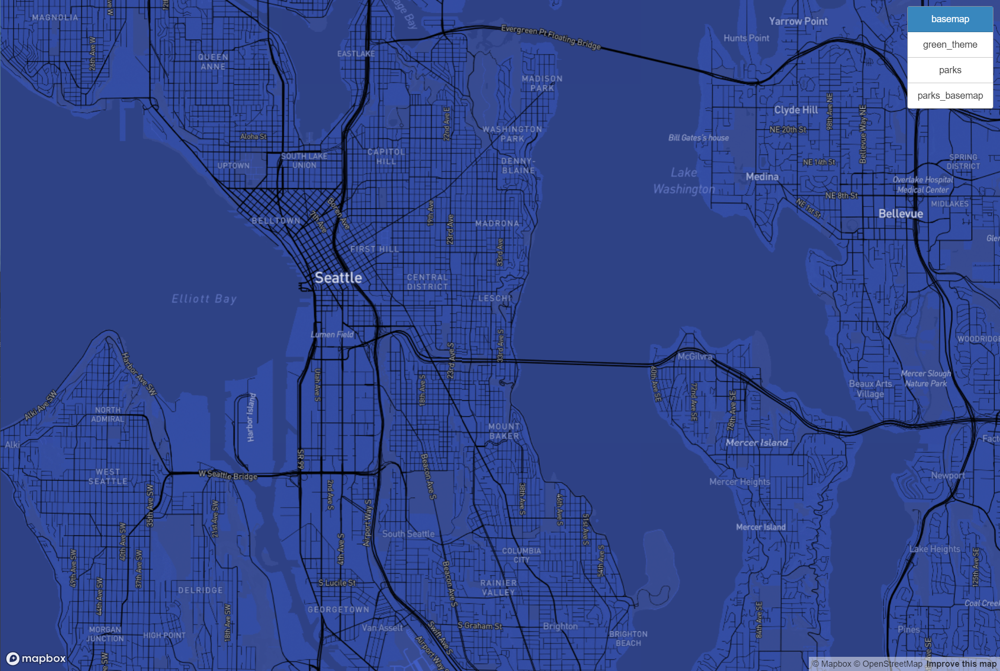
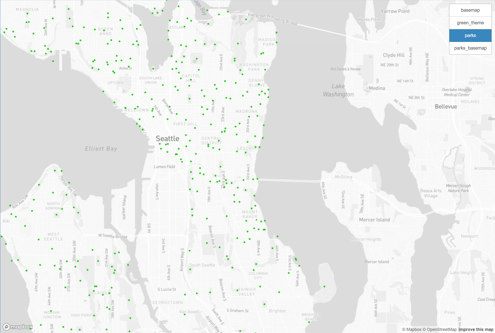
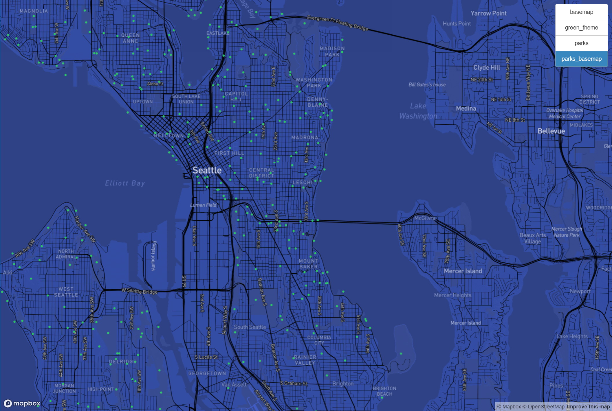
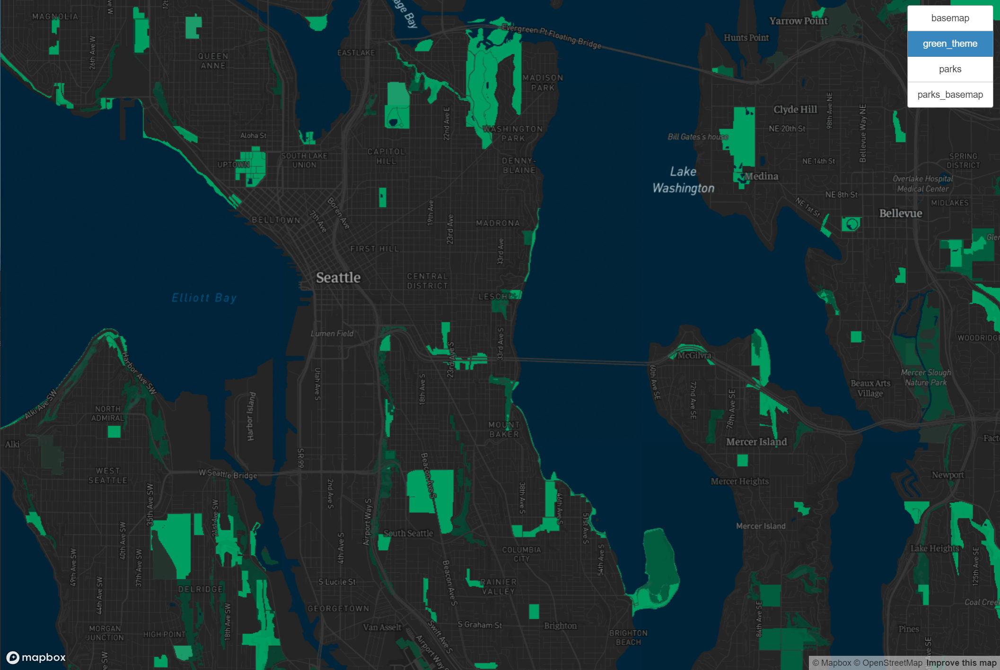

# GEOG 458 Lab 4: Map Design and Tile Generation

[URL to Live Map](https://lawrence03.github.io/geog458_lab04/)

- Each tile set have a zoom level between 3 to 14, and the examined geographic area is Seattle, WA.

## #1 Tile Set: Base Map ('basemap')

- The first tile set is just a monochrome map with slight modification to the color. The map is a simple blue map with a light background.

## #2 Tile Set: Seattle Parks ('parks')

- Source: [Seattle GeoData](https://data-seattlecitygis.opendata.arcgis.com/maps/9baab63b52df417a9b2a168e3f288b1b/about)
- The second tile set is a map of Seattle parks. Parks are represented by green dots with a light base map.

## #3 Tile Set: Seattle Parks with modified base map ('parks_basemap')

- The third tile set is a map of Seattle parks with a modified base map. The base map is a monochrome map with slight modification to the color. The parks are represented by green dots.

## #4 Tile Set: Green Theme Map ('green_theme')

- The fourth tile set is a green theme map. The base map is a monochrome map with slight modification to the color. All the natural features are represented by green color. This map is designed to be used for environmental purposes, and help the community to be more aware of the natural features around them.

## Acknowledgement

- This lab is based on the [Lab 4: Map Design and Tile Generation](https://github.com/jakobzhao/geog458/tree/master/labs/lab04) by Bo Zhao.
